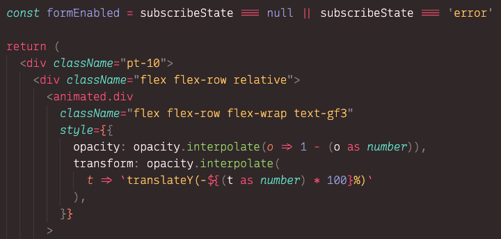

# Recursive Mono Affine

This is my preferred build of [ArrowType's Recurive](https://recursive.design) for coding. The [four existing builds](https://github.com/arrowtype/recursive/blob/main/src/build-scripts/make-release/data/release-notes--code.md#packages) (Linear, Casual, Semicasual, and Duotone) were nice but not _just right_, y'know?

Primarily, I wanted a lighter base weight (300 & 600 versus 400 & 700), and more specific control over the `slnt` and `CASL` to make the italics feel like a [true italic](https://en.wikipedia.org/wiki/Italic_type) (versus an [oblique](https://en.wikipedia.org/wiki/Oblique_type)) but with a toned-down casualness.




Here's the actual definitions for each of the axes:

```
"Affine": {
    "MONO": 1,
    "CASL": 0,
    "wght": 300,
    "slnt": 0,
    "CRSV": 0,
    "style": "Regular",
},
"Affine Italic": {
    "MONO": 1,
    "CASL": 0.5,
    "wght": 300,
    "slnt": -10,
    "CRSV": 1,
    "style": "Italic",
},
"Affine Bold": {
    "MONO": 1,
    "CASL": 0,
    "wght": 600,
    "slnt": 0,
    "CRSV": 0,
    "style": "Bold",
},
"Affine Bold Italic": {
    "MONO": 1,
    "CASL": 0.5,
    "wght": 600,
    "slnt": -10,
    "CRSV": 1,
    "style": "Bold Italic",
}
```

### License

The original is licensed under the [OFL](https://github.com/arrowtype/recursive/blob/main/OFL.txt), so this one is too.